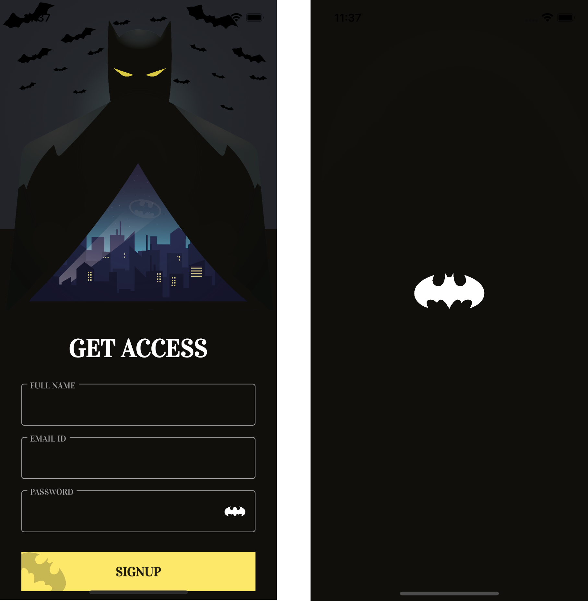
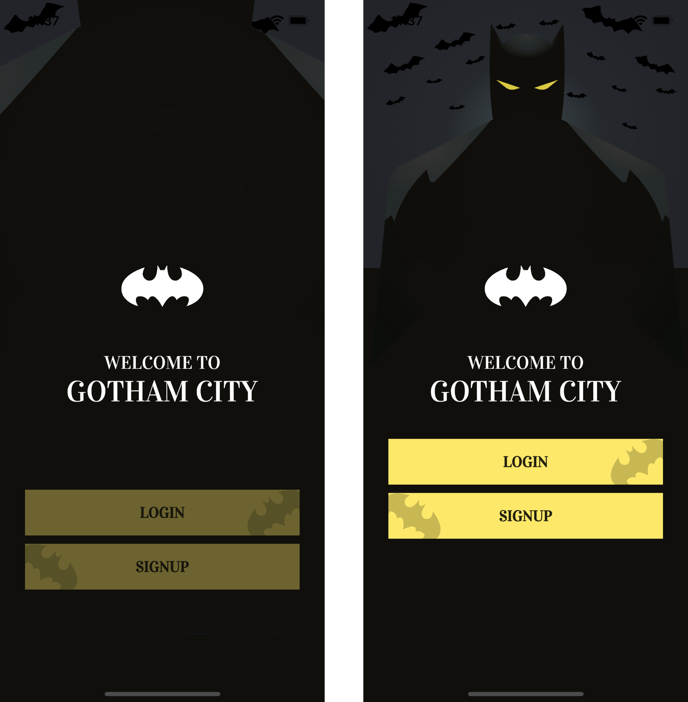

# Batman SignIn
 

 


## Introduction 

Project made with Flutter that shows a login and registration screen with Batman theme, it has several interesting animations. This repository is created for educational purposes.

## Screens


<pre>

</pre>



## 👨🏻‍💻 Author
My name is Renato Montufar, I am a mobile developer, I love UI/UX and I am learning new things all the time. Feel free to contact me! 😀

- [LinkedIn](https://www.linkedin.com/in/deus-magna/)
- [GitHub](https://github.com/deus-magna/)
- [Twitter](https://twitter.com/deus_magna)
- [Instagram](https://www.instagram.com/deus_magna/) 

## 🙈 Inspiration

This repository was created by watching a tutorial by diegoveloper

## 🤝 Contributing

Contributions, issues and feature requests are welcome!

## 🤔 Questions?
You can find me on [](https://twitter.com/burhanrashid52) [](https://www.instagram.com/deus_magna/) [](https://www.linkedin.com/in/deus-magna/)

## Show your support

Give a ⭐️ if this project helped you!

## Credits
- UI/UX Design to [**Sakin Kumar**](https://dribbble.com/shots/13905960-Signup-page-Concept-CreateWithAdobeXD)
- Flutter Tutorial [**Diego Velasquez**](https://www.youtube.com/watch?v=f8jD8ixkXXk&ab_channel=diegoveloper)
- Flutter [**Documentation**](https://flutter.io/docs/)

## Getting Started

This project is a Flutter Application, you can use Visual Studio Code or Android Studio to build it.

```sh
flutter packages get
flutter run --release
```
